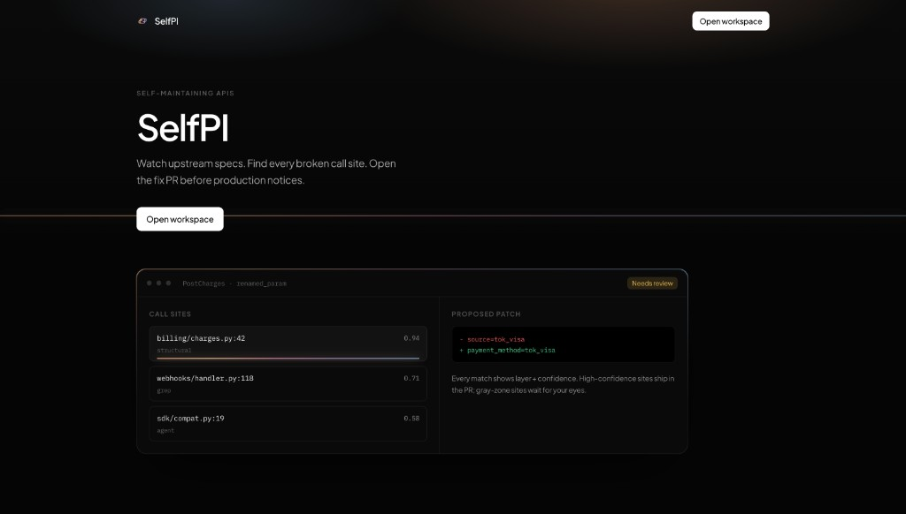
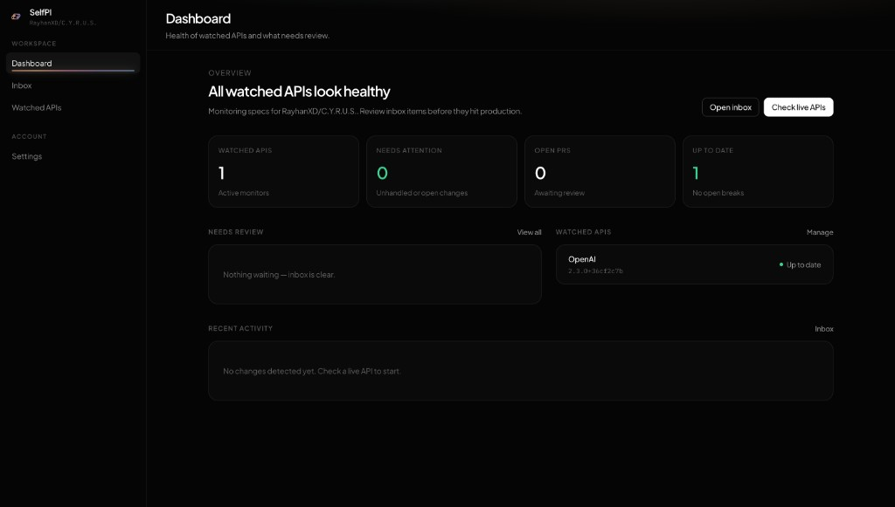
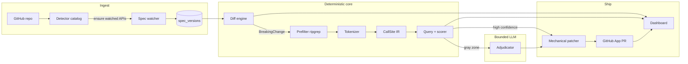

# SelfPI — Dependabot for APIs

**Watch upstream OpenAPI specs, find every broken call site in your repo, and open the fix PR before production notices.**

[](https://selfpi.rayhanm.com/)
[](docs/DEPLOY.md)
[](backend/pyproject.toml)

**Live:** [https://selfpi.rayhanm.com/](https://selfpi.rayhanm.com/) · Solo project · Deployed on Vercel + AWS ECS Fargate + MongoDB Atlas

<p align="center">
  
</p>

<p align="center">
  
</p>

---

## The Problem

Teams ship on third-party APIs — Stripe, OpenAI, GitHub, Twilio, and dozens more. When a vendor renames a parameter, removes a field, or changes a type, the notice is a changelog email nobody reads. Weeks later production breaks, often after the engineer who owned that integration has moved on.

The work is three hard problems glued together:

1. **Know that the contract changed** — not from prose, from the machine-readable spec.
2. **Find every affected call site** — silently missing one is worse than a false positive.
3. **Ship a reviewable fix** — a PR with provenance, not a black-box rewrite.

Dependabot solved this for packages. APIs still break in production.

---

## The Solution

SelfPI is an end-to-end system that closes that loop:

1. You connect a GitHub repo.
2. A **111-vendor catalog** fingerprints SDKs and HTTP hosts in Python *and* TypeScript/JS and starts watching matches that have a public OpenAPI URL (or a URL you provide).
3. A background watcher polls live specs; a **diff engine** classifies breaking changes (`removed_field`, `renamed_param`, `type_changed`, `value_deprecated`).
4. A **custom token-level scanner** (not Semgrep/CodeQL as the core) finds call sites with layer + confidence provenance.
5. A bounded LLM **only adjudicates gray-zone candidates** the deterministic layers already surfaced — it never hunts the repo on its own.
6. A **GitHub App** opens a PR with mechanical patches + a human-readable explanation.

The dashboard makes the whole path visible: watched APIs, change feed, call-site explorer, PR status.

---

## Key Features

- **Repo → APIs, automatically.** Connect once; SelfPI clones the checkout, runs the detector, and watches catalog hits. No hand-curating every integration.
- **Multi-vendor, not a Stripe toy.** Detection spans payments, AI/ML, cloud, auth, observability, and more. Any catalog hit with an OpenAPI URL can be watched, diffed, and fed through the scan→PR pipeline — validated on a real historical Stripe `source` → `payment_method` rename and a self-hosted demo bump you can trigger on demand. Python SDK→`operation_id` surface maps are richest for Stripe and OpenAI today; new vendors extend by appending a map, not rewriting the scanner.
- **Recall-first call-site finding.** Ripgrep prefilter → owned tokenizer → language-agnostic `CallSite` IR → query + multi-signal scorer. Fixture recall target: **100% of true call sites surfaced**.
- **Provenance you can defend in review.** Every match carries `source_layer` (`structural` | `grep` | `agent`) and a confidence score. High-confidence sites ship in the PR; gray-zone waits for eyes.
- **SDK drift the OpenAPI poll will never see.** An audit lane catches legacy pins (e.g. `openai==0.28`) whose publisher fingerprint never changes, and surfaces them as actionable breaks.
- **Production deploy path.** Public demo on Vercel (SPA) + ECS Fargate (API) + Atlas, with GitHub OAuth, App install, and cross-origin session cookies.

---

## Technical Architecture



### Stack (and why)

| Layer | Choice | Why |
|-------|--------|-----|
| API | **Python 3.11 · FastAPI · Pydantic v2** | Deterministic modules stay pure Python functions with fixture tests; FastAPI matches the REST contract the frontend was built against in parallel. |
| DB | **MongoDB** | Spec blobs, embedded `call_sites[]` + `pr` on each change doc — no joins for the hot path. Access isolated in `backend/db/`. |
| Scanner | **Custom token IR** (not tree-sitter/Semgrep core) | Exact-symbol recall problem, not similarity. Embeddings can silently rank a real site below a cutoff — unacceptable for a trust tool. Token-level is more structure-aware than grep, fully owned, unit-testable. |
| LLM | **Anthropic Messages API** (optional; heuristic fallback) | Adjudicator + PR copy only. Offline `HeuristicClient` keeps CI and demos working without keys. |
| GitHub | **GitHub App** (JWT → installation token) | OAuth identifies the human; installation token opens PRs. Clone-on-connect into `.cache/checkouts/`. |
| UI | **React 19 · Vite · Tailwind · TypeScript** | Dark-minimal dashboard; monospace for paths/diffs; layer badges + confidence bars per `docs/FRONTEND_GUIDELINES.md`. |
| Deploy | **Vercel · ECS Fargate · Atlas** | SPA on the edge; long-running watcher loop on Fargate; managed Mongo. |

### Engineering decisions that matter

**1. Recall is a contract, not a vibe.**  
Deterministic layers must never silently drop a real call site. If ripgrep finds nothing, the scanner still walks language files. False positives can be reviewed; silent misses cannot. Encoded in `CLAUDE.md` and enforced with golden fixtures under `fixtures/`.

**2. Language-agnostic `CallSite` IR.**  
Python `stripe.Charge.create(source=…)` and a future JS surface normalize to the same shape keyed by OpenAPI `operation_id`, not SDK method names. New language = new module under `backend/languages/` — don't patch the core. TypeScript/JS detection ships today; call-site scan/patch in v1 is Python-first.

**3. Bound the LLM.**  
The adjudicator only sees candidates the deterministic pipeline already produced (`confidence < 0.85` or comment hits). It confirms or rejects — it never scans. Patches for known kinds (e.g. `renamed_param`) are mechanical line rewrites; the model writes the PR narrative.

**4. Catalog over scattered vendor strings.**  
`backend/detector/catalog.py` holds 111 `ApiCatalogEntry` records (packages, imports, npm names, HTTP hosts, optional `spec_url`). Extend by appending an entry. Entries without a public OpenAPI URL surface as *detectable but unwatchable* so the UI can prompt for a URL.

**5. Live vs demo isolation.**  
Demo bumps and live Stripe/OpenAI polls cannot poison each other's fingerprints. Live APIs refuse to diff a tiny/demo prior against a full live spec (`is_comparable_baseline`), avoiding a flood of false `removed_field` noise on first connect.

**6. What scales / what's hard.**  
Polling and diff are cheap per watched API. Scanner cost is dominated by candidate-file tokenize+IR — bounded by the prefilter. The hard part isn't CRUD: it's keeping recall at 100% on fixtures while staying precise enough that PRs are reviewable, mapping SDK surfaces → `operation_id` without lying about vocabulary, and shipping auth/cookies correctly across Vercel ↔ API origins.

**Known ceiling (documented):** token matching does not do cross-statement data flow (`x = create(); … x.source` many lines later). Upgrade path is AST/CodeQL — deliberately out of v1.

---

## How It Works

```
Connect repo  →  detect APIs from catalog  →  watch OpenAPI
                      ↓
              poll / Check now / Bump demo
                      ↓
         fingerprint → store spec_versions
                      ↓
         detect_breaking_changes(old, new)
                      ↓
    per change: scan → adjudicate → embed call_sites
                      ↓
         generate_and_open_pr  →  status: pr_open
```

| Step | Module | Notes |
|------|--------|-------|
| Detect | `backend/detector/` | Python manifests + imports; TS/JS `package.json` + imports + host substrings |
| Watch | `backend/watcher/` | Live APIs on a schedule (`WATCH_INTERVAL_SECONDS`, default 300s); demo never auto-polled |
| Diff | `backend/diff/` | Pure functions; fixture triples in `fixtures/diff/` |
| Scan | `backend/scanner/` | Prefiter → tokenize → IR → query → score |
| Adjudicate | `backend/scanner/adjudicator/` | Gray zone only |
| Patch / PR | `backend/patcher/` | Mechanical edits + GitHub App trees/blobs/PR |
| Orchestrate | `backend/pipeline/process.py` | Spec bump + optional SDK audit on unchanged polls |

---

## Results / Impact

| Claim | Evidence |
|-------|----------|
| End-to-end loop works | Demo **Bump spec** and live **Check now** both drive the same pipeline; GitHub App opens real PRs when configured |
| Historical Stripe rename | `fixtures/historical/stripe_source_to_payment_method/` — `source` → `payment_method`; `pytest tests/test_historical_stripe.py` |
| Scanner fixture recall | Success criterion: **100%** of true call sites surfaced on scanner fixtures |
| Multi-vendor detection | **111** catalog entries; detector fixtures under `fixtures/detector/` (Stripe, OpenAI, Anthropic, GitHub, Slack, Auth0, LangChain, NVIDIA, TS Octokit, …) |
| Public production demo | [selfpi.rayhanm.com](https://selfpi.rayhanm.com/) — Vercel + Fargate + Atlas |
| Test suite | **88** backend tests (`make test`) |

Built solo. Scope is a working product slice — not a tutorial CRUD app — with design docs, an API contract, deploy infra, and fixture-backed deterministic cores.

---

## Running it locally

**Prereqs:** Python 3.11+, Node 20+. MongoDB is started automatically by `make` (portable binary; Docker optional).

```bash
make
```

- UI: http://localhost:5173  
- API: http://localhost:8000/health  
- Stop: `make stop` · clean re-seed: `make reset`

Optional GitHub App + OAuth env vars (for real PRs and login) are documented in `backend/.env.example`. Full deploy: [`docs/DEPLOY.md`](docs/DEPLOY.md).

```bash
make test   # backend pytest
```

---

## Repo map

```
backend/     watcher · diff · scanner · detector · pipeline · patcher · api · db · languages
frontend/    React dashboard + landing
fixtures/    diff triples · scanner goldens · detector trees · historical Stripe
docs/        design · PRD · engineering plan · API contract · frontend guidelines · deploy
infra/aws/   Terraform for ECS Fargate
```

**Docs worth opening:** [`docs/self-maintaining-apis-design.md`](docs/self-maintaining-apis-design.md) (why a custom scanner) · [`docs/API_CONTRACT.md`](docs/API_CONTRACT.md) · [`CLAUDE.md`](CLAUDE.md) (recall / purity / IR rules)

---

## GitHub

https://github.com/RayhanXD/SelfPI
