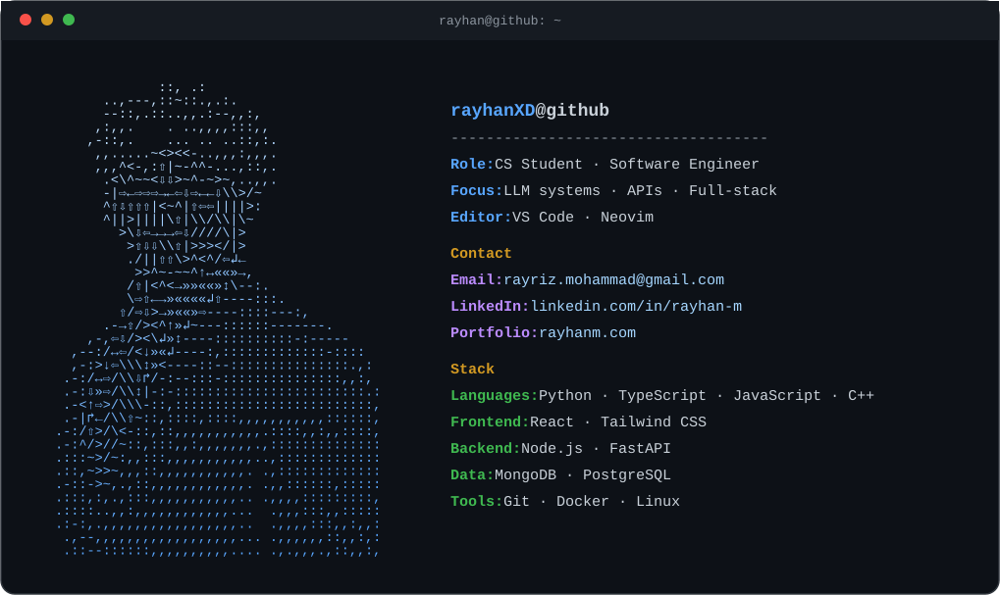

<!--
  Rayhan — GitHub profile README
  Repo: github.com/RayhanXD/RayhanXD  (repo name MUST equal your username)
  card.svg lives next to this file in the same repo.
-->

  

  
  
  

<!-- ============ LIVE STATS (auto-updates, no maintenance) ============ -->

  
  

  

  

